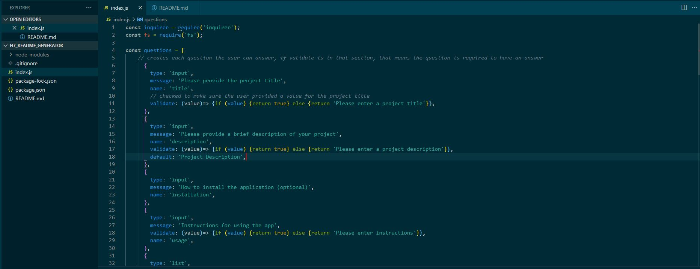

# H7_README_Generator
## Description
This readme generator allows a user to create a professional readme for use in creating projects. This makes it much quicker to make a professional readme while you are working on a project and gives users a template to work on. This was a great introduction to node and specifically inquirer for user input and fs for file creation

## Table of Contents
- [Installation](#installation)
- [Usage](#usage)
- [Credits](#credits)
- [License](#license)

## Installation
- Open the file in the integrated git bash terminal
- run this command to install inquirer: npm install inquirer
- run the file: node index.js

## Usage
Follow the question prompts to generate the readme and make sure to be as descriptive as possible

   

## Credits
- Instructors
- Ask BCS
- Javier Perez: (https://www.youtube.com/watch?v=2VUQABoFOqw)

## License
MIT License

Copyright (c) [2021] [Molly-Singmaster]

Permission is hereby granted, free of charge, to any person obtaining a copy
of this software and associated documentation files (the "Software"), to deal
in the Software without restriction, including without limitation the rights
to use, copy, modify, merge, publish, distribute, sublicense, and/or sell
copies of the Software, and to permit persons to whom the Software is
furnished to do so, subject to the following conditions:

The above copyright notice and this permission notice shall be included in all
copies or substantial portions of the Software.

THE SOFTWARE IS PROVIDED "AS IS", WITHOUT WARRANTY OF ANY KIND, EXPRESS OR
IMPLIED, INCLUDING BUT NOT LIMITED TO THE WARRANTIES OF MERCHANTABILITY,
FITNESS FOR A PARTICULAR PURPOSE AND NONINFRINGEMENT. IN NO EVENT SHALL THE
AUTHORS OR COPYRIGHT HOLDERS BE LIABLE FOR ANY CLAIM, DAMAGES OR OTHER
LIABILITY, WHETHER IN AN ACTION OF CONTRACT, TORT OR OTHERWISE, ARISING FROM,
OUT OF OR IN CONNECTION WITH THE SOFTWARE OR THE USE OR OTHER DEALINGS IN THE
SOFTWARE.

## Questions

- Github username: mollymoo002
- Email: mollysingmaster@gmail.com

